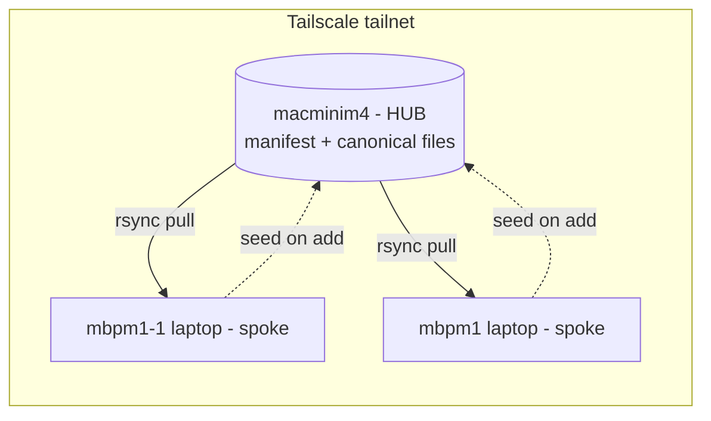

# ymir - Complete Guide

`ymir` keeps a **managed, add/removable list** of config paths in sync from one **hub**
machine to your other Macs, over your **Tailscale** tailnet. No cloud service, nothing
exposed to the public internet.

- [1. What it is](#1-what-it-is)
- [2. Concepts](#2-concepts)
- [3. How it works internally](#3-how-it-works-internally)
- [4. Requirements](#4-requirements)
- [5. Install](#5-install)
- [6. Configuration reference](#6-configuration-reference)
- [7. Command reference](#7-command-reference)
- [8. Typical workflows](#8-typical-workflows)
- [9. Automation (launchd)](#9-automation-launchd)
- [10. Security model](#10-security-model)
- [11. Troubleshooting](#11-troubleshooting)
- [12. Testing without a hub](#12-testing-without-a-hub)
- [13. Scope and limitations](#13-scope-and-limitations)
- [14. FAQ](#14-faq)

---

## 1. What it is

A ~250-line Bash CLI (`bin/ymir`) that wraps `rsync` running over Tailscale SSH. It
solves one problem: "keep these particular config files/dirs the same across my Macs,
and let me add or remove paths from that set at any time."

It is deliberately **one-way**: a single hub is the source of truth and its config is
pulled down to every other machine. That trades multi-writer convenience for zero
conflict logic and no chance of a stale laptop overwriting good config.

---

## 2. Concepts

| Term | Meaning |
|------|---------|
| **Hub** | The one machine that owns the truth. Default `macminim4`. Holds the manifest and the canonical copy of every managed path. |
| **Spoke** | Any other Mac that pulls from the hub. Your laptops. |
| **Manifest** | `~/.config/ymir/paths.list` **on the hub**. One managed path per line. This is the add/removable list. |
| **Managed path** | A file or directory registered in the manifest and therefore synced. |
| **HOME-relative** | Managed paths under your home are stored without the `/Users/<name>` prefix (e.g. `.config/nvim`), so they map correctly even though the hub user and laptop user differ. |
| **Transport** | How ymir reaches the hub: `ssh` (real, over Tailscale) or `local` (for testing). |
| **Seed** | The one-time upload of a path from a spoke to the hub when you first `add` a path that only exists locally. |

### Topology



Solid arrows = the normal `sync` (hub -> spoke). Dotted arrows = the one-time `add` seed
(spoke -> hub) that only happens the first time a locally-existing path is registered.

---

## 3. How it works internally

### The manifest is the single source of "what"

`add`/`rm`/`list` all operate on the manifest **on the hub** (over the transport). Because
the manifest lives in one place, running `add ~/.zshrc` on your laptop changes the managed
set for every machine. Each spoke discovers the change on its next `sync`.

### Path normalisation (`to_rel`)

Every path you pass is normalised:

1. `~` / `~/x` expands to `$HOME` / `$HOME/x`.
2. Relative paths become absolute against the current directory.
3. A trailing slash is stripped.
4. If the result is under `$HOME`, it is stored **HOME-relative** (`.config/nvim`).
   Otherwise it is stored **absolute** (and will not remap across users - you get warned
   in the docs, not silently).

This is why the hub account (`sk...`) and the laptop account (`sky0`) can both resolve
`.zshrc` to their own `/Users/<name>/.zshrc`.

### `add` algorithm

```
rel = to_rel(input)
if rel looks like a secret and not --force: refuse, skip
if rel exists locally but not on hub:  rsync push local -> hub     (seed)
append rel to hub manifest (deduped)
```

### `sync` algorithm (the core)

```
manifest = read hub:~/.config/ymir/paths.list
cache manifest locally
for each rel in manifest:
    isdir = (hub: test -d ~/rel)
    mkdir -p local parent of rel
    rsync -a [--delete if MIRROR=1] --exclude <secrets> \
          hub:rel  ->  local:rel      (trailing slash added for dirs)
record timestamp; log ok/fail counts
```

`sync` is **idempotent**: run it as often as you like. rsync only transfers differences.

### Transport abstraction

Two functions isolate all remoteness:

- `hub_exec "<cmd>"` runs a shell command on the hub (`ssh user@host "<cmd>"`, or, in
  `local` mode, runs it with `HOME` pointed at `HUB_ROOT`).
- the rsync calls build `hub:path` sources (or `HUB_ROOT/path` in local mode).

That is what makes the tool testable without a hub (see [section 12](#12-testing-without-a-hub)).

---

## 4. Requirements

- **Tailscale** on hub and spokes, all logged into the same tailnet.
- **Tailscale SSH enabled on the hub**: `sudo tailscale set --ssh` (already on for
  `macminim4`). This lets spokes SSH in using Tailscale identity - no SSH keys to manage.
- **GNU rsync** on the spoke: `brew install rsync` (installs `/opt/homebrew/bin/rsync`).
  ymir auto-prefers it over macOS's limited `openrsync`.
- The hub's local macOS **account name** (run `id -un` on the hub) for `HUB_USER`.

---

## 5. Install

Recommended - the guided wizard:

```sh
brew install rsync         # GNU rsync (once per machine)
./bin/ymir setup           # prereqs, hub/spoke, config, PATH symlink, agent
```

Manual equivalent:

```sh
ln -sf "$PWD/bin/ymir" /opt/homebrew/bin/ymir   # put on PATH
ymir init                                          # write ~/.config/ymir/config
$EDITOR ~/.config/ymir/config                      # set HUB_USER="<id -un on hub>"
ymir status                                         # expect: reachable: yes
```

Run `ymir setup` on each machine. The manifest is shared (it lives on the hub), so you
only build the managed set once.

---

## 6. Configuration reference

File: `~/.config/ymir/config` (plain shell, sourced by ymir).

| Key | Default | Meaning |
|-----|---------|---------|
| `HUB_HOST` | `macminim4` | Hub MagicDNS name or Tailscale IP. |
| `HUB_USER` | *(empty)* | **Required.** Local macOS username on the hub. |
| `IS_HUB` | `0` | Set to `1` on the hub itself: `add`/`rm`/`list` edit the local manifest, `sync` is a no-op. |
| `TRANSPORT` | `ssh` | `ssh` for real use; `local` for tests (needs `HUB_ROOT`). |
| `HUB_ROOT` | *(empty)* | Test only: a directory that stands in for the hub's `$HOME`. |
| `MIRROR` | `0` | `1` adds `rsync --delete`: files removed on the hub are deleted locally. Destructive. |
| `INTERVAL` | `300` | launchd sync interval, seconds. |
| `HUB_RSYNC_PATH` | *(empty)* | Set to `/opt/homebrew/bin/rsync` if the hub has GNU rsync, to force it server-side. |

Environment overrides (handy for testing): `YMIR_CFG_DIR`, `YMIR_LOG`.

---

## 7. Command reference

Every command also has `ymir <command> --help`.

### `ymir setup`
Guided interactive setup and the recommended way to start. Checks Tailscale + GNU rsync
(offers to install rsync), asks whether this machine is the HUB or a SPOKE, collects
`HUB_HOST`/`HUB_USER`, writes `~/.config/ymir/config`, optionally symlinks `ymir` onto
PATH, tests hub reachability, and optionally installs the launchd agent. Re-runnable
(asks before overwriting); falls back to defaults when run non-interactively.
```sh
ymir setup
```

### `ymir init`
Write the config template if it does not exist. Never overwrites. Does not need a hub.

### `ymir add [--force] PATH...`
Register path(s). Seeds a locally-existing path up to the hub the first time. Refuses
secret-looking paths unless `--force`. Accepts absolute, `~`-relative, or cwd-relative
paths. Run from any Mac.
```sh
ymir add ~/.zshrc ~/.config/nvim ~/.gitconfig
ymir add ~/.config/ghostty          # directory, synced recursively
ymir add --force ~/.config/app/x.env
```

### `ymir rm PATH...`
Unregister path(s). Removes only the manifest entry; local and hub copies stay.
```sh
ymir rm ~/.zshrc
```

### `ymir list` (alias `ls`)
Print managed paths, read live from the hub manifest.

### `ymir sync`
Pull all managed paths hub -> this machine. Idempotent. Honors `MIRROR`. This is what the
launchd agent runs.

### `ymir status`
Show hub `user@host`, transport, reachability, managed count, last sync time.

### `ymir install-agent`
Install + load a launchd agent that runs `sync` at login and every `INTERVAL` seconds.
Re-run to apply a new `INTERVAL`.

### `ymir uninstall-agent`
Unload and delete the agent. Config and files untouched.

### `ymir help [command]` / `ymir --help` / `-h`
Overview, or detailed help for one command.

---

## 8. Typical workflows

### Defining which folders on the hub get distributed

A managed path is just an entry in the hub manifest whose content lives at that
HOME-relative location **on the hub** (`macminim4`). You define one in either place:

**On the hub itself (recommended for curating).** Set `IS_HUB="1"` in
`~/.config/ymir/config` on `macminim4`, then add real folders/files that live there.
In hub mode ymir edits the local manifest directly (no SSH, no seeding) and `sync`
is a no-op because the hub is the source:
```sh
# on macminim4
ymir init
$EDITOR ~/.config/ymir/config       # set IS_HUB="1"
ymir add ~/.config/nvim ~/Documents/dotfiles ~/.zshrc
ymir list
ymir status                         # role: HUB (macminim4) - source of truth
```
Then on each spoke: `ymir sync` pulls those exact paths down.

**From a spoke.** `ymir add ~/path` registers the path in the hub manifest over SSH.
If the folder exists only on the hub, it is just registered (spokes pull it). If it
exists locally but not yet on the hub, its current content is seeded up once, after
which the hub owns it.

Either way the manifest is shared, so the folder is "defined" once and every spoke
receives it. Remove one with `ymir rm ~/path`.

### First-time setup (hub is `macminim4`, you are on a laptop)
```sh
ymir init
$EDITOR ~/.config/ymir/config      # HUB_USER="<id -un on hub>"
ymir status                        # reachable: yes
ymir add ~/.zshrc ~/.gitconfig ~/.config/nvim
ymir sync
ymir install-agent                 # keep it current automatically
```

### Add a new path later (from any Mac)
```sh
ymir add ~/.config/starship.toml
ymir sync        # or wait for the agent
```

### Stop syncing something
```sh
ymir rm ~/.config/nvim
```

### Change config that is under management
Edit it **on the hub** (`macminim4`). On a spoke, edits are overwritten by the next
`sync`. If you must edit on a spoke, do it, then run `ymir add` again is not needed -
instead copy up manually or switch to a two-way engine (see FAQ).

---

## 9. Automation (launchd)

`install-agent` writes `~/Library/LaunchAgents/com.ymir.sync.plist`:

- `RunAtLoad` - sync at login.
- `StartInterval` = `INTERVAL` seconds - periodic sync.
- stdout/stderr -> `~/.config/ymir/ymir.log`.

Inspect / control:
```sh
launchctl list | grep com.ymir
tail -f ~/.config/ymir/ymir.log
ymir uninstall-agent
```

---

## 10. Security model

- **Transport privacy:** all traffic rides Tailscale (WireGuard) between your own
  devices. Nothing is exposed publicly. Do not point Tailscale Funnel at synced paths.
- **Auth:** Tailscale SSH authenticates by tailnet identity; no long-lived SSH keys.
- **Secret guard:** these patterns are excluded from every transfer and blocked by `add`
  (override with `--force`):
  `.ssh/*  id_rsa  id_ed25519  *.pem  *.key  *.p12  *.pfx  *.keychain*  .aws/credentials  .gnupg/*  .netrc  *.env  .env`
- **Blast radius:** `MIRROR=1` deletes local files that are gone on the hub. Keep it `0`
  unless you truly want an exact mirror.

---

## 11. Troubleshooting

| Symptom | Cause / fix |
|---------|-------------|
| `HUB_USER not set` | Edit `~/.config/ymir/config`; run `id -un` on the hub for the value. |
| `failed to look up local user "X"` | Wrong `HUB_USER`. It must be the hub's **local** account, not the tailnet email. |
| `status` shows `reachable: NO` | Hub offline, wrong `HUB_HOST`, or Tailscale SSH off on the hub (`sudo tailscale set --ssh`). |
| `cannot read hub manifest` | Hub unreachable, or nothing added yet (empty is fine, `list` shows "(manifest empty)"). |
| First SSH hangs / prompts | Tailscale SSH may require a one-time browser check; approve it, then retry. |
| A path did not update | Check it is in `ymir list`, not matched by a secret pattern, and that you edited it **on the hub**. |
| rsync flag errors | Ensure GNU rsync: `brew install rsync` (system `openrsync` lacks options). |

Verbose peek: `tail -n 50 ~/.config/ymir/ymir.log` and `tailscale status`.

---

## 12. Testing without a hub

The `local` transport treats a directory as a fake hub, so you can exercise the full
add/seed/sync/rm/secret-guard flow offline:

```sh
T=/tmp/ymir-test; rm -rf "$T"; mkdir -p "$T/spoke" "$T/hub"
echo v1 > "$T/spoke/.zshrc"; echo hub > "$T/hub/.gitconfig"
mkdir -p "$T/spoke/.config/ymir"
printf 'TRANSPORT="local"\nHUB_ROOT="%s"\nMIRROR="0"\n' "$T/hub" > "$T/spoke/.config/ymir/config"
( cd "$T/spoke" && HOME="$T/spoke" ymir add .zshrc .gitconfig && HOME="$T/spoke" ymir sync )
cat "$T/hub/.zshrc"        # seeded up
cat "$T/spoke/.gitconfig"  # pulled down
```

---

## 13. Scope and limitations

- **One-way only.** Edits on a spoke are overwritten. Curate on the hub.
- **Macs only.** iOS nodes (iPad/iPhone) cannot run the agent; treat them as read-only via
  a Tailscale file client if needed.
- **No conflict resolution.** By design - there is a single writer (the hub).
- **Paths outside `$HOME`** are stored absolute and do not remap across differing usernames.

---

## 14. FAQ

**Can I edit config on any machine and have it merge both ways?**
Not with this tool - it is intentionally one-way. Swap the engine under the same CLI to
**Unison** (bidirectional + conflict review over Tailscale SSH) or **Syncthing**
(continuous P2P mesh). The `docs/product/config-sync-capability.md` contract covers both.

**Why not Taildrive?**
Taildrive mounts a remote folder over WebDAV; it is remote *access*, not local *sync*. It
would not give you a working local copy that survives the hub being offline.

**Why pull instead of push?**
A spoke pulling only needs the hub reachable and only writes to itself. A hub pushing would
need SSH into every spoke and could clobber a machine that is mid-edit.

**Does it handle large directories?**
Yes - rsync only transfers deltas. Keep genuinely large data out of the managed set
though; this is for config, not media.
