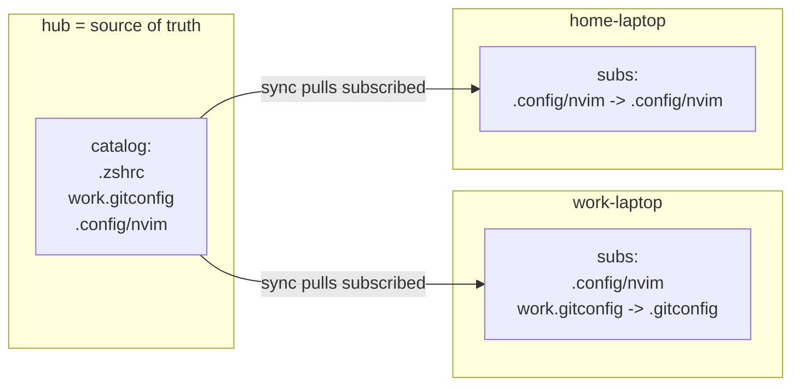

# ymir - Complete Guide

`ymir` syncs config across your Macs with a **publish/subscribe** model, entirely over
your **Tailscale** tailnet. No cloud service, nothing exposed to the public internet.

- [1. What it is](#1-what-it-is)
- [2. The model](#2-the-model)
- [3. How it works internally](#3-how-it-works-internally)
- [4. Requirements](#4-requirements)
- [5. Install](#5-install)
- [6. Configuration reference](#6-configuration-reference)
- [7. Command reference](#7-command-reference)
- [8. Workflows](#8-workflows)
- [9. Automation (launchd)](#9-automation-launchd)
- [10. Security model](#10-security-model)
- [11. Troubleshooting](#11-troubleshooting)
- [12. Testing without a hub](#12-testing-without-a-hub)
- [13. Scope and limitations](#13-scope-and-limitations)
- [14. FAQ](#14-faq)

---

## 1. What it is

A single Bash CLI (`bin/ymir`) that wraps `rsync` over Tailscale SSH. One machine (the
**hub**) publishes a catalog of paths it offers. Every other machine (a **spoke**)
subscribes to the items it wants and decides where each one lands locally.

## 2. The model

Two lists, two authorities:

| List | Lives on | Owner decides | Contents |
|------|----------|---------------|----------|
| **share catalog** | the hub | hub = what is shareable | `~/.config/ymir/shares.list` -> HOME-relative hub paths |
| **subscriptions** | each spoke | spoke = what it wants + where | `~/.config/ymir/paths.list` -> `SHARE -> DEST` |

- The **hub** is the source of truth for file content and for the set of shareable paths.
- A **spoke** reads the catalog, subscribes to items, and sets a local destination per
  item (defaults to the same path).
- `sync` on a spoke pulls each subscription `hub:SHARE -> spoke:DEST`, but only if
  `SHARE` is still in the hub catalog. Un-sharing on the hub stops future pulls.
- The hub never references a spoke; spokes are self-selecting. That is why the hub does
  not need to "know" the spokes.



## 3. How it works internally

### Two files
- Hub `shares.list`: plain HOME-relative paths (the catalog).
- Spoke `paths.list`: `SHARE [-> DEST]` lines (the subscriptions). `DEST` defaults to
  `SHARE`.

### Where `--to` is remembered
`ymir add --to ~/.gitconfig work.gitconfig` on a spoke normalizes both paths to
HOME-relative and writes ONE line to the spoke's own list:
```
work.gitconfig -> .gitconfig
```
`ymir sync` reads that line, splits it on `->`, and runs
`rsync hub:~/work.gitconfig -> ~/.gitconfig`. Nothing is guessed; the mapping is stored
text.

### Parsing (`parse_entry`)
Resets its outputs first (so a mapped line never leaks its dest into the next line),
splits on the first ` -> `, trims whitespace (incl a trailing `\r`), strips a trailing
`/` from `DEST`, and defaults `DEST` to `SRC`.

### Destination safety (`dest_ok`)
`DEST` is validated before use: a leading `/` (absolute) or any `..` segment is rejected,
so a subscription can never write outside your home. `--to` also runs through the
HOME-relative normalizer.

### Sync rule
For each subscription: validate `DEST`; skip if the hub no longer shares `SRC`
(gatekeeping); rsync `hub:SRC -> $HOME/DEST` (directory vs file handled automatically);
apply `--delete` (MIRROR) only when `DEST == SRC`.

### Role awareness
`load_cfg` reads `IS_HUB`. On the hub, `add`/`rm`/`list` map to
`share`/`unshare`/`shares` and `sync` is a no-op. On a spoke they manage subscriptions
and `sync` pulls.

### Transport
`hub_exec` runs a command on the hub via `ssh` (Tailscale) or, for tests, `local`
(treats `$HUB_ROOT` as the hub's `$HOME`).

## 4. Requirements

- **Tailscale** on hub and spokes, same tailnet.
- **Tailscale SSH on the hub**: `sudo tailscale set --ssh` (spokes SSH in by tailnet
  identity, no keys).
- **GNU rsync** on each machine: `brew install rsync` (ymir prefers it over openrsync).
- The hub's local macOS **account name** for a spoke's `HUB_USER` (run `id -un` on the hub).

## 5. Install

Recommended - the guided wizard:
```sh
brew install rsync
./bin/ymir setup           # prereqs, hub/spoke, config, PATH symlink, agent
```

Manual:
```sh
ln -sf "$PWD/bin/ymir" /opt/homebrew/bin/ymir
ymir init
$EDITOR ~/.config/ymir/config   # hub: IS_HUB=1   |   spoke: HUB_USER=<id -un on hub>
ymir status
```

Run `ymir setup` on every machine (one hub, the rest spokes).

## 6. Configuration reference

File: `~/.config/ymir/config` (plain shell, sourced by ymir).

| Key | Default | Meaning |
|-----|---------|---------|
| `HUB_HOST` | `hub` | Hub MagicDNS name or Tailscale IP. |
| `HUB_USER` | *(empty)* | Spoke only: local macOS username on the hub. |
| `IS_HUB` | `0` | `1` on the hub: publish/share here; `sync` is a no-op. |
| `TRANSPORT` | `ssh` | `ssh` for real use; `local` for tests (needs `HUB_ROOT`). |
| `HUB_ROOT` | *(empty)* | Test only: a directory that stands in for the hub's `$HOME`. |
| `MIRROR` | `0` | `1` adds `rsync --delete`, but only for same-path subscriptions. |
| `INTERVAL` | `300` | launchd sync interval, seconds. |
| `HUB_RSYNC_PATH` | *(empty)* | `/opt/homebrew/bin/rsync` if the hub has GNU rsync. |

Env overrides (testing): `YMIR_CFG_DIR`, `YMIR_LOG`.

## 7. Command reference

Every command also has `ymir <command> --help`.

### Setup
- `ymir setup` - guided interactive setup (recommended).
- `ymir init` - write the config template.

### Hub (source of truth)
- `ymir share [--force] PATH...` - add path(s) to the catalog.
- `ymir unshare PATH...` - remove from the catalog.
- `ymir shares` - print the catalog.

### Spoke
- `ymir catalog` (alias `hub-ls`) - show what the hub shares.
- `ymir add [--from SHARE] [--to DEST] SHARE...` - subscribe; `--from` names the hub source, `--to` the local placement. Positional SHARE also works.
- `ymir add --all` - subscribe to everything shared (same paths).
- `ymir rm SHARE...` - unsubscribe (matches the SHARE field only).
- `ymir list` - show subscriptions (`SHARE -> DEST`).
- `ymir sync` - pull subscribed items to their chosen destinations.
- `ymir publish [--as SHARE] LOCALPATH` - push a local path to the hub and share it.

### Common
- `ymir status` - role, reachability, counts, last sync.
- `ymir install-agent` / `uninstall-agent` - launchd auto-sync.

`add`/`rm`/`list` are role-aware (hub: catalog; spoke: subscriptions).

## 8. Workflows

### First time
On the hub:
```sh
ymir setup                          # choose HUB
ymir share ~/.zshrc ~/.config/nvim ~/work.gitconfig
```
On each spoke:
```sh
ymir setup                          # choose SPOKE, enter hub username
ymir catalog
ymir add ~/.config/nvim
ymir add --from work.gitconfig --to ~/.gitconfig
ymir sync
ymir install-agent
```

### Per-machine destinations (the reason for `--to`)
```sh
# work-laptop wants the work gitconfig at ~/.gitconfig:
ymir add --from work.gitconfig --to ~/.gitconfig
# home-laptop wants a different source at the same local path:
ymir add --from personal.gitconfig --to ~/.gitconfig
```
Each spoke decided its own placement; the hub only had to `share` both files.

### Stop sharing / stop receiving
```sh
# hub: stop offering it (spokes stop pulling on next sync)
ymir unshare ~/.zshrc
# spoke: stop pulling it (keeps the local copy)
ymir rm work.gitconfig
```

### Curate from a laptop
```sh
# on a spoke: push a file up and share it in one step
ymir publish ~/.config/starship.toml
```

## 9. Automation (launchd)

`ymir install-agent` writes `~/Library/LaunchAgents/com.ymir.sync.plist`:
- `RunAtLoad` (sync at login) + `StartInterval` = `INTERVAL`.
- Output to `~/.config/ymir/ymir.log`.

```sh
launchctl list | grep com.ymir
tail -f ~/.config/ymir/ymir.log
ymir uninstall-agent
```

## 10. Security model

- **Transport**: all traffic rides Tailscale (WireGuard) between your own devices.
  Do not point Tailscale Funnel at synced paths.
- **Auth**: Tailscale SSH authenticates by tailnet identity; no long-lived SSH keys.
- **Hub authority**: a spoke can only pull paths the hub currently shares.
- **Destination safety**: a subscription cannot write outside `$HOME` (`..`/absolute
  rejected). `MIRROR=1` never deletes for a remapped destination.
- **Secret guard**: `.ssh/*  id_rsa  id_ed25519  *.pem  *.key  *.p12  *.pfx
  *.keychain*  .aws/credentials  .gnupg/*  .netrc  *.env  .env` are excluded from every
  transfer and blocked by `share`/`publish` without `--force`.

## 11. Troubleshooting

| Symptom | Cause / fix |
|---------|-------------|
| `HUB_USER not set` | Spoke config missing the hub account; run `ymir setup` or set it. |
| `failed to look up local user "X"` | Wrong `HUB_USER`; use the hub's `id -un`, not the tailnet email. |
| `hub unreachable` | Hub offline, wrong `HUB_HOST`, or Tailscale SSH off on the hub. |
| `not shared by hub, skipped: X` | The hub does not share `X`; `ymir share X` on the hub. |
| Subscription not applying | Check `ymir list`; ensure the SHARE name matches `ymir catalog`. |
| rsync flag errors | Install GNU rsync: `brew install rsync`. |

Logs: `tail -n 50 ~/.config/ymir/ymir.log`; peers: `tailscale status`.

## 12. Testing without a hub

The `local` transport treats a directory as a fake hub. See `tests/parse.sh` for parser
unit tests, and this end-to-end shape:
```sh
R=/tmp/ymir-t; rm -rf "$R"; HB="$R/hub"; SP="$R/spoke"; mkdir -p "$HB/.config/ymir" "$SP/.config/ymir"
echo zrc > "$HB/.zshrc"
printf 'IS_HUB="1"\n' > "$HB/.config/ymir/config"
printf 'TRANSPORT="local"\nHUB_ROOT="%s"\n' "$HB" > "$SP/.config/ymir/config"
( cd "$HB" && HOME="$HB" ymir share .zshrc )
( cd "$SP" && HOME="$SP" ymir add --to .zshrc-copy .zshrc && HOME="$SP" ymir sync )
cat "$SP/.zshrc-copy"     # -> zrc
```

## 13. Scope and limitations

- One-way pull; the hub is authoritative. No write-back from spokes (use `publish` to
  push a file up deliberately).
- Macs only. iOS nodes cannot run the agent; use a Tailscale file client read-only.
- Paths may not contain spaces, ` -> `, ` @`, or single quotes (config paths in practice
  do not). A legacy line containing ` -> ` would be reparsed as a mapping.
- A directory subscription uses rsync contents-merge semantics (`dir/ -> other/`).

## 14. FAQ

**Who decides where a file lands?** The spoke, via `--to`. The hub only decides what is
available.

**How does the hub know which spoke wants what?** It does not. Each spoke keeps its own
subscription list and pulls its own picks. The hub just publishes and gatekeeps.

**Can two machines place the same shared file differently?** Yes - each spoke's `--to` is
independent.

**Why not Taildrive?** Taildrive mounts a remote folder over WebDAV; it is remote access,
not local sync, and would not survive the hub being offline.

**Two-way sync?** Not by design. Use `publish` to push a specific file up; general
bidirectional merge is out of scope (would need conflict handling).
