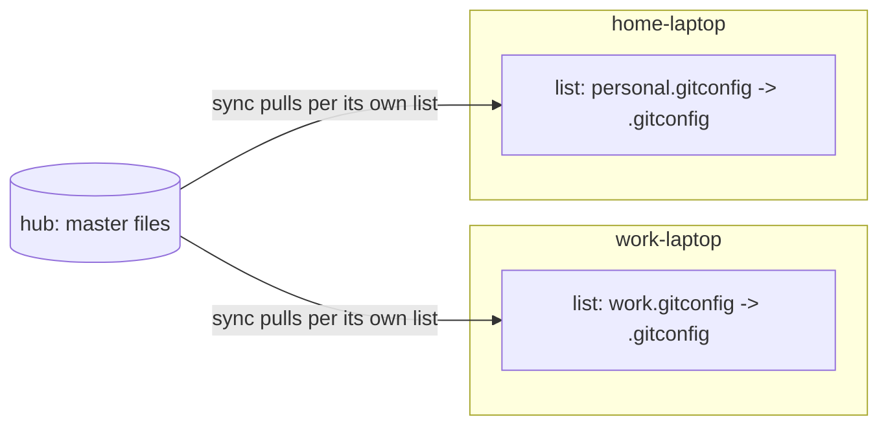

# Blueprint: ymir spoke-defined routing

Objective: each spoke decides which hub files it wants and where they land locally.
The hub just holds files; it needs zero knowledge of the spokes.

Status: REVIEWED design pivot (was hub-defined; user chose spoke-defined routing).
Mode: git present (origin github.com/sgtkuncoro/ymir, `main`). One commit per step.

---

## Why this model (resolves the earlier objection)

Objection: "the hub doesn't know the spokes, so it can't define a per-spoke dest."
Correct. So we move the routing to the spoke:

- **Hub** = a bag of files (the master copies). Knows nothing about spokes.
- **Spoke** = keeps its OWN list of pull rules: "get `hub:SRC`, put it at my `DEST`".
- Each spoke only ever manages its own list, so per-machine destinations are natural
  and `--for`/targeting/`NODE_NAME` disappear entirely.

This is a change from today, where the list lives on the hub and is shared. After this
change the list lives **locally on each spoke**.



## Grammar (spoke-local manifest: `~/.config/ymir/paths.list` on each spoke)

```
SRC [-> DEST]
```
- `SRC`  path on the hub (HOME-relative).
- `DEST` path on THIS spoke (HOME-relative); defaults to `SRC`.
- No `@targets` and no `NODE_NAME` (the list is already per-spoke).

Plain lines stay valid (`.zshrc` = pull `hub:~/.zshrc` -> `~/.zshrc`).

## Command semantics (all run ON the spoke; no SSH needed to edit the list)

| Command | Runs on | Effect |
|---|---|---|
| `ymir add [--to DEST] SRC...` | spoke | add pull rule(s) to the LOCAL list |
| `ymir rm SRC...` | spoke | remove local rule(s) by SRC |
| `ymir list` | spoke | show this spoke's rules |
| `ymir sync` | spoke | pull each rule hub:SRC -> local:DEST |
| `ymir status` | spoke | hub reachable, rule count, last sync |
| `ymir hub-ls [PATH]` | spoke | list what's available under the hub's home (discovery) |
| `ymir publish [--as SRC] LOCALPATH` | spoke | push a local file UP to the hub (optional) |

Hub side: just hold files. `ymir status` on the hub (IS_HUB=1) reports role HUB; add/
rm/list/sync are no-ops there (the hub does not subscribe).

## Safety / correctness (carried from the prior adversarial review)

- **DEST validation** [C3/M1]: reject leading `/` or any `..` segment; `--to` runs
  through `to_rel` and must resolve inside `$HOME`. Never build `$HOME/$DEST` from an
  unvalidated field.
- **MIRROR delete-gating** [C2]: `--delete` (MIRROR=1) applies only when `DEST == SRC`,
  so a remap can never wipe a shared parent dir on the spoke.
- **Parser reset** [C1]: `parse_entry` resets `E_SRC/E_DEST` first, then recomputes
  `E_DEST=${E_DEST:-$E_SRC}`.
- **rm by SRC field** [M2]: decode each line's SRC and compare equal; never bare grep.
- **Trim/CRLF** [m2]: strip surrounding whitespace incl `\r`; strip trailing `/` from
  DEST before adding the dir suffix.
- **Sourcing guard** [m5]: `[ "${BASH_SOURCE[0]}" = "$0" ] && main "$@"` for testability.
- Secret guard still applies to SRC. Still one-way pull.

## Non-goals

- No `@targets`/`NODE_NAME` (dropped; per-spoke list replaces them).
- No spaces / ` -> ` / single quotes in paths (documented limitation).
- Directory remap uses rsync contents-merge; documented.

---

## Steps

### Step 1 - Move the list to the spoke + SRC->DEST parser + tests  [strongest]

Context: today `read_manifest`/`cmd_add`/`cmd_rm`/`cmd_list` operate on the HUB manifest
via `hub_exec`. This step makes the list LOCAL.

Tasks:
1. Point `read_manifest`, `cmd_add`, `cmd_rm`, `cmd_list` at the LOCAL
   `$CFG_DIR/paths.list` (no `hub_exec` for list management).
2. Add `parse_entry` (reset-first, split ` -> `, trim incl `\r`, strip trailing `/` on
   DEST, `E_DEST=${E_DEST:-$E_SRC}`) and `dest_ok` (reject `/` prefix and `..`).
3. Sourcing guard at file bottom; add `tests/parse.sh` covering plain / dest-only /
   plain-after-dest reset / dest_ok rejects `../x` and `/x`.
4. `cmd_add` keeps the secret guard on SRC; dedup on the composed line.

Verify: `bash tests/parse.sh`; `bash -n bin/ymir`; `ymir add`/`list`/`rm` edit the local
file with no hub round trip (test with hub unreachable).
Exit: list is spoke-local; parser + tests committed.

### Step 2 - Routing-aware sync from the local list  [default]  (dep: Step 1)

Tasks:
1. `cmd_sync` reads the LOCAL list; per line `parse_entry`; `dest_ok` false -> warn+skip.
2. rsync `hub:E_SRC` -> `$HOME/E_DEST`; dir suffix from remote `test -d E_SRC`;
   `mkdir -p` dest parent.
3. `--delete` only when `E_DEST == E_SRC` [C2].
4. Summary: synced / skipped / failed.

Verify (local transport): `.a -> .b` lands at `~/.b`; plain line same path; MIRROR=1 with
a remap does not delete dest siblings (assert an unrelated file survives).
Exit: sync pulls per the local rules with safe delete-gating.

### Step 3 - `--to`, discovery, publish, status/help/docs  [default]  (dep: Step 2)

Tasks:
1. `cmd_add`: `--to DEST` (single SRC; multi -> error) normalized via `to_rel` + `dest_ok`.
2. `cmd_add` seed/publish: if `hub:SRC` missing but local `DEST` exists, offer to push
   local `DEST` -> `hub:SRC` (keeps the convenient first-time upload).
3. `ymir hub-ls [PATH]`: list entries under the hub home (or PATH) so you can see what
   SRC values exist to pull. (`hub_exec "ls -1 ~/PATH"`.)
4. `ymir publish [--as SRC] LOCALPATH`: explicit push of a local file up to the hub.
5. `cmd_list` renders `SRC -> DEST` (omit `-> DEST` when equal). `cmd_status` shows
   rule count + hub reachability. Update usage + help_topic.

Verify: `add --to .b .a` -> local line `.a -> .b`; `add --to ../evil .a` rejected;
`hub-ls` lists hub files; `rm .a` drops only `.a`.
Exit: full spoke-defined routing usable end to end.

### Step 4 - setup + docs  [default]  (dep: Step 3)

Tasks:
1. `cmd_setup`: spoke path unchanged except it explains the list is local; hub path
   unchanged. (No NODE_NAME needed anymore - remove any prior NODE_NAME wording.)
2. GUIDE.md: rewrite routing section for the spoke-defined model (grammar, `--to`,
   `hub-ls`, `publish`, examples, DEST safety, dir-merge caveat).
3. README.md: short spoke-defined example.
4. capability doc: mark spoke-defined routing delivered.

Verify: `ymir setup` writes correct config; docs fences balanced; full regression
(plain + mapped, hub-ls, publish); `bash -n` clean.
Exit: documented + configurable.

---

## Dependency graph

```
Step1 -> Step2 -> Step3 -> Step4    (all edit bin/ymir -> serial)
```

## Invariants after every step

- `bash tests/parse.sh` + `bash -n bin/ymir` pass.
- Managing the list needs NO hub connection (it is local); only `sync`/`hub-ls`/
  `publish` touch the hub.
- No rule can write outside `$HOME`; MIRROR never deletes a remapped dest.
- No real machine names / IPs / usernames in the repo.

## Migration note

Existing installs keep the hub manifest; after this change the list is read locally. On
each spoke, re-add the paths you want (or copy the old hub `paths.list` down once). This
is a one-time, documented step.
