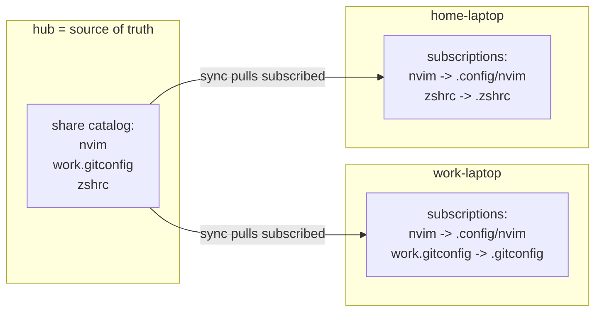

# Blueprint: ymir publish/subscribe routing

Objective: the HUB decides what to share (source of truth + share catalog); each SPOKE
decides which shared items it pulls and WHERE they land locally. The hub needs no
knowledge of the spokes.

Status: DESIGN (pub/sub model, confirmed with user)
Mode: git present (origin github.com/sgtkuncoro/ymir, `main`). One commit per step.

---

## The model

Two lists, two authorities:

| List | Lives on | Owner decides | Contents |
|------|----------|---------------|----------|
| **share catalog** | the hub | hub = what is shareable | `~/.config/ymir/shares.list` -> HOME-relative hub paths |
| **subscriptions** | each spoke | spoke = what it wants + where | `~/.config/ymir/paths.list` -> `SHARE -> DEST` |

Rules:
- The hub publishes a **catalog** of paths it offers. It is the source of truth for
  both the file content and the set of shareable paths.
- A spoke reads the catalog, **subscribes** to the items it wants, and sets a local
  destination per item (defaults to the same path).
- `sync` on a spoke pulls each subscription `hub:SHARE -> spoke:DEST`, but only if
  `SHARE` is still in the hub catalog (hub stays the gatekeeper). Un-sharing on the hub
  stops future pulls.
- The hub never references a spoke. Spokes are self-selecting.



## Commands by role

### Hub (IS_HUB=1) - decides what is shared
| Command | Effect |
|---|---|
| `ymir share PATH...` | add PATH (must exist on hub) to the share catalog |
| `ymir unshare PATH...` | remove from the catalog |
| `ymir shares` (alias `list`) | show what the hub offers |
| `ymir sync` | no-op (the hub is the source) |
| `ymir status` | role HUB, N shared |

### Spoke - decides what it pulls and where
| Command | Effect |
|---|---|
| `ymir catalog` (alias `hub-ls`) | show the hub's share catalog (over SSH) |
| `ymir add [--to DEST] SHARE...` | subscribe to a shared item, optional local placement |
| `ymir add --all` | subscribe to everything currently shared (same paths) |
| `ymir rm SHARE...` | unsubscribe |
| `ymir list` | show this spoke's subscriptions (`SHARE -> DEST`) |
| `ymir sync` | pull each subscription hub:SHARE -> local:DEST |
| `ymir status` | role spoke, N subscriptions, hub reachable |

## Grammars

- Hub `shares.list`: one HOME-relative path per line (plain; this is today's hub
  manifest, just renamed conceptually to "shares").
- Spoke `paths.list`: `SHARE [-> DEST]` (DEST defaults to SHARE).

## Safety / correctness (carried from the adversarial review)

- **Catalog gatekeeping**: a spoke `sync` pulls a SHARE only if it is in the hub's
  current catalog; otherwise skip+warn. Hub stays source of truth.
- **DEST validation** [C3/M1]: reject leading `/` or any `..`; `--to` via `to_rel`,
  must resolve inside `$HOME`.
- **MIRROR delete-gating** [C2]: `--delete` only when `DEST == SHARE`.
- **Parser reset** [C1]: reset `E_SRC/E_DEST` first; `E_DEST=${E_DEST:-$E_SRC}`.
- **rm/unshare by field** [M2]: decode the key field and compare equal; never bare grep.
- **Trim/CRLF, trailing slash** [m2]; **sourcing guard** [m5] for tests.
- Secret guard applies to SHARE at `share` time. One-way pull only.

## Non-goals

- No `@targets` / `NODE_NAME` (self-selection via subscriptions replaces them).
- No spaces / ` -> ` / single quotes in paths (documented).
- Directory shares use rsync contents-merge; documented.

---

## Steps

### Step 1 - Hub share catalog + parser + tests  [strongest]

Context: today the hub manifest + `cmd_add/rm/list` already implement a hub-side list.
Reframe it as the SHARE CATALOG and make the verbs role-aware.

Tasks:
1. Rename the hub list concept to `shares.list`; on the hub, `share`/`unshare`/`shares`
   manage it (keep `add`/`rm`/`list` as aliases when IS_HUB=1). Keep the secret guard.
2. Add `parse_entry` (reset-first, split ` -> `, trim incl `\r`, strip trailing `/` on
   DEST) + `dest_ok` (reject `/` prefix, `..`).
3. Sourcing guard + `tests/parse.sh` (plain, dest-only, reset-after-dest, dest_ok).

Verify: `bash tests/parse.sh`; `bash -n bin/ymir`; on hub, share/unshare/shares work.
Exit: hub catalog + parser + tests committed.

### Step 2 - Spoke subscriptions + catalog view  [default]  (dep: Step 1)

Tasks:
1. Spoke-local `paths.list` of `SHARE -> DEST`. `cmd_add` on a spoke = subscribe:
   `--to DEST` (single SHARE; normalize via `to_rel` + `dest_ok`), `--all` to subscribe
   to every catalog entry at its own path. Managing subscriptions needs NO hub round
   trip except `--all`/validation.
2. `ymir catalog` / `hub-ls`: fetch and print the hub `shares.list` (over SSH).
3. On `add`, warn if SHARE is not in the current catalog (typo guard) but still allow.
4. `cmd_rm` unsubscribe by SHARE field. `cmd_list` renders `SHARE -> DEST`.

Verify (local transport): subscribe with/without `--to`; `catalog` lists hub shares;
`add --to ../evil x` rejected; `rm` drops only the named SHARE.
Exit: spokes can browse the catalog and manage placement.

### Step 3 - Routing-aware spoke sync (gatekept)  [default]  (dep: Step 2)

Tasks:
1. `cmd_sync` (spoke): read local subscriptions; per line `parse_entry`; `dest_ok`
   false -> warn+skip; SHARE not in hub catalog -> warn+skip (gatekeeping).
2. rsync `hub:SHARE` -> `$HOME/DEST`; dir suffix from remote `test -d SHARE`;
   `mkdir -p` dest parent. `--delete` only when `DEST == SHARE` [C2].
3. Hub `sync` stays a no-op. Summary: synced / skipped / failed.

Verify: subscribed `nvim -> .config/nvim` lands correctly; un-shared item is skipped on
next sync; MIRROR remap does not delete dest siblings.
Exit: end-to-end pub/sub sync with hub authority.

### Step 4 - setup + docs + optional publish  [default]  (dep: Step 3)

Tasks:
1. `cmd_setup`: hub path explains `share`; spoke path explains `catalog` + `add --to`.
2. Optional `ymir publish [--as SHARE] LOCALPATH` (spoke): push a local file to the hub
   AND add it to the catalog - convenience for curating from a laptop.
3. GUIDE.md + README.md: rewrite for the pub/sub model with examples; capability doc
   marks it delivered. Keep generic (no real machine names).

Verify: `ymir setup` both roles; docs fences balanced; full regression; `bash -n` clean.
Exit: documented + configurable.

---

## Dependency graph

```
Step1 -> Step2 -> Step3 -> Step4   (all edit bin/ymir -> serial)
```

## Invariants after every step

- `bash tests/parse.sh` + `bash -n bin/ymir` pass.
- Hub is the sole authority on what is shareable; a spoke cannot pull an un-shared path.
- Subscriptions are spoke-local; managing them needs no hub round trip (except catalog
  view / `--all`).
- No subscription can write outside `$HOME`; MIRROR never deletes a remapped dest.
- Repo stays generic (no real machine names / IPs / usernames).

## Migration

Today's hub manifest becomes the share catalog (rename `paths.list` -> `shares.list` on
the hub, or keep the filename and treat it as the catalog). Spokes gain a new local
subscription list; on first run a spoke subscribes (or `add --all`) to what it wants.
Documented one-time step.
